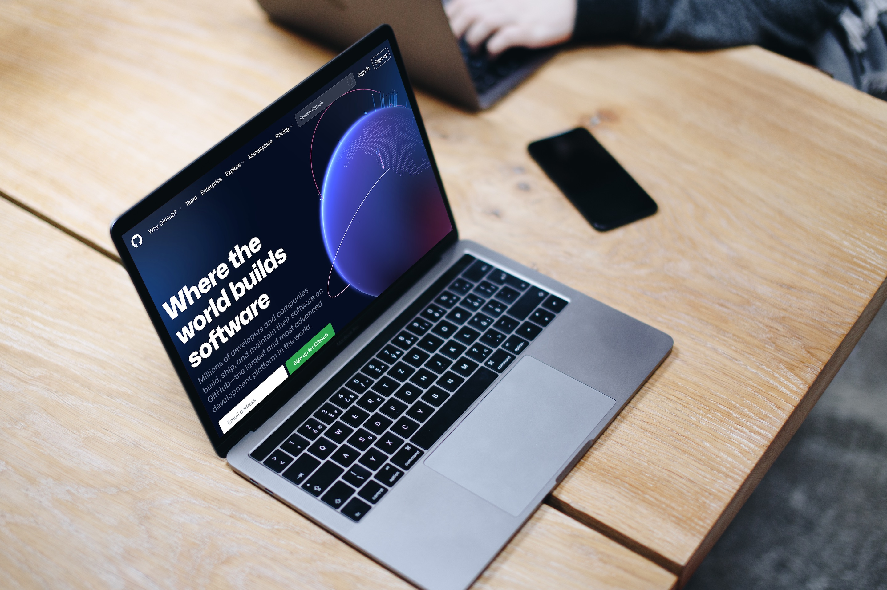

# GitHub for no-coders presentation

This presentation is an exploration of the features and benefits of GitHub for no-code uses. Compiled by [@pglevy](https://github.com/pglevy) as part of the Makerpad No-Code Fundamentals course, cohort 4.

## Outline

Here's an overview of the slide content and links.

### Agenda
- Why GitHub
- What it offers
- When to consider
- What to do next

### A little about me

- Early web nerd
- Roundabout route to UX Design
- Head of Design at [Bixal](https://www.bixal.com/)

Follow me on [Twitter](https://twitter.com/pglevy)!

### Bixal

A civic tech firm working with the U.S. federal government to improve digital services.

### Why it’s relevant

- The #buildinpublic O.G.
- DeCo: decentralized code and content
- Bundling of project management, documentation, and knowledge sharing tools

### Free

*Oh, and did I mention you can do most everything you need to do for free?*

*—[GitHub Pricing](https://github.com/pricing)*

### Tracking work

- [Project boards](https://docs.github.com/en/issues/organizing-your-work-with-project-boards/managing-project-boards/about-project-boards)
    - [Notes](https://docs.github.com/en/issues/organizing-your-work-with-project-boards/tracking-work-with-project-boards/adding-notes-to-a-project-board) for lightweight tasks
    - [Issues](https://docs.github.com/en/issues/organizing-your-work-with-project-boards/tracking-work-with-project-boards/adding-issues-and-pull-requests-to-a-project-board) for more robust features
- [New project experience](https://docs.github.com/en/issues/trying-out-the-new-projects-experience/about-projects) in beta
- Examples:
    - [Rapid Response Team](https://github.com/Bixal/rapid-response-team/projects?query=is%3Aclosed)
    - [#MPNC4](https://github.com/pglevy/mpnc4/projects?query=is%3Aclosed)
    - [U.S. Web Design System](https://github.com/orgs/uswds/projects/1)

### Marking progress

- [Milestones](https://docs.github.com/en/issues/using-labels-and-milestones-to-track-work/about-milestones) for grouping related work
- [Releases](https://docs.github.com/en/repositories/releasing-projects-on-github/about-releases) for documenting updates
- Examples:
    - [Rapid Response Team](https://github.com/Bixal/rapid-response-team/milestones?state=closed)
    - [Bixal Methods](https://github.com/Bixal/methods/releases)
    - [U.S. Web Design System](https://github.com/uswds/uswds/releases/tag/v2.12.2)

### Documenting and sharing

- [README](https://docs.github.com/en/repositories/managing-your-repositorys-settings-and-features/customizing-your-repository/about-readmes)
    - Example: [USWDS Screener Prototyping Tool](https://github.com/Bixal/uswds-screener-prototyping-tool#readme)
- [Wiki](https://docs.github.com/en/communities/documenting-your-project-with-wikis/about-wikis)
    - Example: [Rapid Response Team](https://github.com/Bixal/rapid-response-team/wiki)
- Built-in blogging with [GitHub Pages](https://pages.github.com/) and [Jekyll](https://jekyllrb.com/)

### Community and collaboration

- [Discussions](https://docs.github.com/en/discussions/collaborating-with-your-community-using-discussions/about-discussions)
    - Example: [Rapid Response Team Ideas](https://github.com/Bixal/rapid-response-team/discussions/categories/ideas)
- [Collaborators](https://docs.github.com/en/account-and-profile/setting-up-and-managing-your-github-user-account/managing-access-to-your-personal-repositories/inviting-collaborators-to-a-personal-repository)
- [Community standards](https://docs.github.com/en/communities)
    - Example: [U.S. Web Design System](https://github.com/uswds/uswds/community)
- Advanced: [version control with git](https://docs.github.com/en/get-started/using-git/about-git)
    - My [YouTube video](https://www.youtube.com/watch?v=Yvu4uoE1fVo&t=10s) on getting started

### When to consider

- Working with devs who are already using it
- Simple, free way to build in public
    - Create a homebase to reference your other work
    - Maintain full control over your content
- More advanced version control of content

### Next steps

1. Create an account
1. Poke around
1. Glance at my [glossary](https://github.com/Bixal/methods/wiki/GitHub-glossary)
1. Learn [Markdown](https://docs.github.com/en/github/writing-on-github/getting-started-with-writing-and-formatting-on-github/basic-writing-and-formatting-syntax)
1. [Subscribe to my newsletter!](https://www.getrevue.co/profile/pglevy)

## About this template

The purpose of this template is to enable [Bixalers](https://www.bixal.com/) to create presentation content using a webpage instead of tools like Google Slides or PowerPoint.

Get [more information about this template](https://github.com/Bixal/presentation-template#readme) and how to use it or check out some [slide layouts and example content](https://bixal.github.io/presentation-template/).